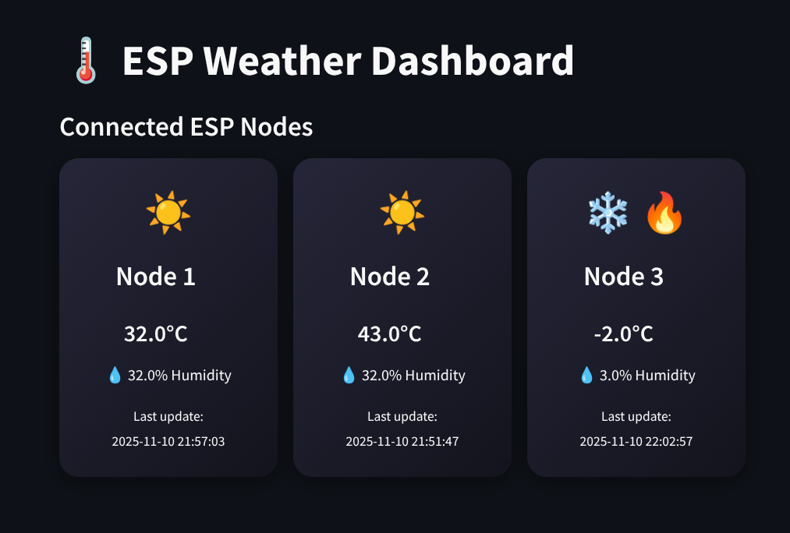

# 🌡️ ESP Weather Dashboard

A simple **IoT monitoring web app** built using **Streamlit (frontend)** and **FastAPI (backend)** to visualize **temperature** and **humidity** data sent from multiple **ESP nodes**.

---

## 🧠 Project Overview

- Each **ESP node** sends its temperature & humidity data to the **FastAPI backend**.
- The backend stores current values and logs historical data.
- The **Streamlit frontend** displays live readings in a dark, weather-themed UI.

---

## ⚙️ Tech Stack

- **ESP32 / ESP8266** → sensor node firmware (sends JSON via HTTP)
- **FastAPI** → backend API (receives & serves data)
- **Streamlit** → frontend dashboard
- **Requests / Pandas** → data handling & visualization

---

## 🚀 Setup Instructions

### 1. Clone the repository

```bash
git clone https://github.com/yourusername/esp-weather-dashboard.git
cd esp-weather-dashboard
```

### 2. Install dependencies

```bash
pip install -r requirements.txt
```

_(Make sure Python 3.9+ is installed)_

### 3. Run the backend (FastAPI)

```bash
python3 backend.py
```

### 4. Run the frontend (Streamlit)

```bash
streamlit run frontend.py --server.port 8501
```

### 5. Send data from ESP / test with curl

```bash
curl -X POST http://localhost:8000/update \
-H "Content-Type: application/json" \
-d '{"node_id":"1","temperature":26.5,"humidity":60.2}'
```

---

## 📊 Features

- Live temperature & humidity cards per node
- Auto-refresh every few seconds
- Interactive dark weather-themed UI
- Node sorting & graph display for selected node
- Compatible with ESP32/ESP8266 devices

---

## 🧩 Directory Structure

```
├── Backend
│   └── backend.py
├── Firmware
│   └── ESP_Node
│       └── ESP_Node.ino
├── Frontend
│   └── frontend.py
└── README.md
```

---

## 🛰️ Example ESP Code Snippet

```cpp
String jsonData = "{\"node_id\": \"1\", \"temperature\": 25.6, \"humidity\": 61.2}";
http.begin("http://<server_ip>:8000/update");
http.addHeader("Content-Type", "application/json");
int code = http.POST(jsonData);
```

---

## 📸 Dashboard Preview

Example layout with real-time data and node cards in dark weather theme.

## 
